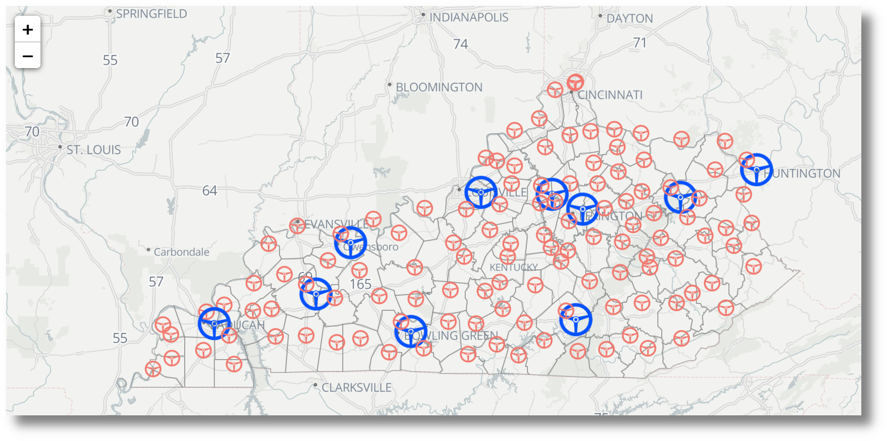

# Kentucky Drivers Licensing Sites

# About The Project

Historically, Kentucky drivers sought and renewed their drivers' licenses at the courthouse in the county of their residence. This is about to change. Instead, Kentucky drivers will, beginning June 30, 2022, obtain all of their licenses in 18 to 24 regional licensing facilities that are run by the Kentucky Transportation Cabinet ("KYTC"). This project plots existing courthouse locations, excepting Jefferson and Fayette counties, and the announced regional KYTC facilities.

## REAL ID Act

Recent legislative action in Kentucky and other states regarding drivers' licenses is an effort to comply with the federal law, known as the The Real ID Act of 2005\. That law sets minimum standards for the states to issue a driver's license.

The federal government may reject a state issued personal identification card when it is presented for an official purpose. "Official purpose" includes the boarding of a commercial aircraft, entering federal facilities, and entering nuclear power plants.

Because of The Real ID Act's wide ranging impact on transportation, states have come under increased pressure to upgrade their licensing procedures to meet the new federal standard. Compliance with the act was recently extended to October 21, because of the covid-19 pandemic. The Department for Homeland Security has published extensive information that can be found [here](https://www.dhs.gov/real-id).

## HB 453

On March 27, Governor Beshear signed HB 453 into law. The bill vests KYTC with the exclusive responsibility for issuing operator's licenses and personal identification cards. Residents will no longer be required to apply for these documents in their county of residence. The bill will also expand the number of documents an applicant can use when applying for a license and allows for people to choose between four to eight years before renewal. Circuit clerks' offices will continue issuing standard--but not Real IDs--identification credentials until the KYTC determines that one of its 18 to 24 budgeted regional offices are capable of assuming all issuance duties. All Circuit Court Clerks will be required to cease issuing licenses and personal ID cards by June 30, 2022.

# Built With

The visualization was built with [Leaflet.js](https://leafletjs.com).

# License

Distributed under the MIT License. See `LICENSE` for more information.

# Contact

Rob Wiederstein - [@https://twitter.com/RobWiederstein](https://twitter.com/your_username) - rob@robwiederstein.org

Project Link: <https://github.com/RobWiederstein/hip_hop_artists>

# Acknowledgements

- [Kentucky Administrative Office of the Courts](https://kycourts.gov/aoc/pages/default.aspx)
- [Kentucky Transportation Cabinet](https://transportation.ky.gov/Pages/Home.aspx)
- [Kentucky GIS Open Data Portal](http://kygovmaps-kygeonet.opendata.arcgis.com)

- [David Kahle and his ggmaps package](https://github.com/dkahle/ggmap/blob/master/README.md)

- [Aleszu Bajak at Storybench for his readable article on geocoding in R](https://www.storybench.org/geocode-csv-addresses-r/)

- [Jesse Lecy, Quick Guide to XML in R (2016)](https://lecy.github.io/Open-Data-for-Nonprofit-Research/Quick_Guide_to_XML_in_R.html)
